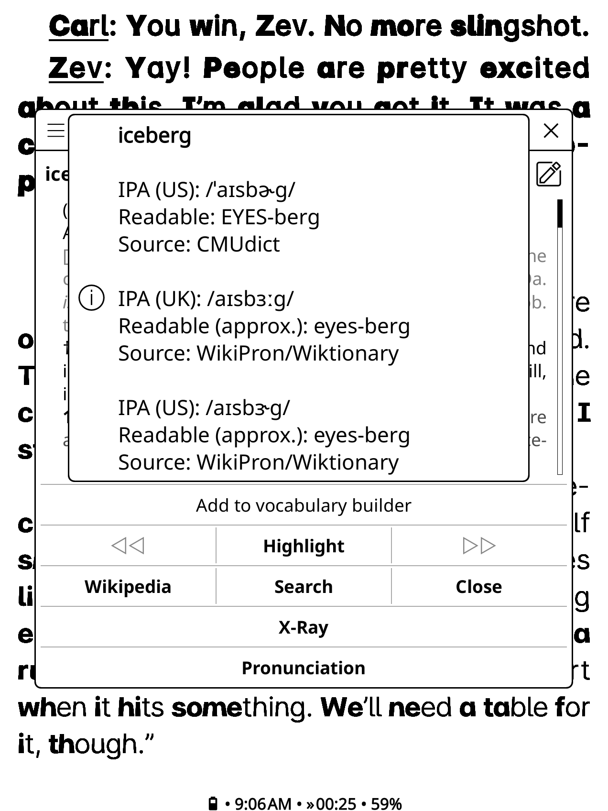
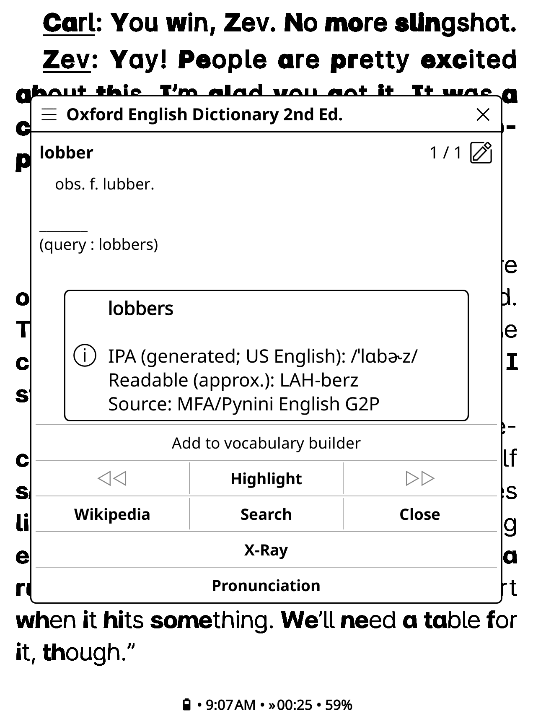

# Pronunciation Dictionary for KOReader

Offline IPA and readable pronunciation lookup for KOReader.

## Features

- Bundled US and UK English pronunciations from CMUdict and WikiPron
- Readable spellings, IPA, regional labels, and source attribution
- Offline estimates for unfamiliar names and invented words
- Optional online fallback through Dictionary API and English Wiktionary
- Personal pronunciation overrides

## Screenshots
 

## Install

### Method 1: Install via Storefront (Recommended)
If you use the Storefront plugin manager for KOReader, you can install and update Pronunciation directly on your device without connecting to a computer:

1. Open KOReader on your device.
2. Open the Tools menu (wrench icon / menu) and launch Storefront.
3. Search for or browse to Pronunciation in the plugin list. (You may have to set the filter to show zero stars)
4. Tap Install.
4. Restart KOReader when prompted.

> [!TIP]
> Storefront will automatically check for new Pronunciation releases and allow seamless, one-tap updates directly on your e-reader.

### Method 2: Manual Installation
1. Download `pronunciation.koplugin-<version>.zip` from the repository's
   Releases page.
2. Extract it into `koreader/plugins/`.
3. Confirm this path exists:

   ```text
   koreader/plugins/pronunciation.koplugin/main.lua
   ```

4. Restart KOReader.

## Use

- Open a dictionary result and tap **Pronunciation**.
- Long-press **Pronunciation** to add or edit a personal override.
- Use **Search → Pronunciation lookup** to enter a word manually.

Settings are under **Search → Settings → Pronunciation dictionary**, beside
KOReader's **Dictionary settings**:

- **Online fallback** enables Dictionary API and Wiktionary lookup.
- **Generated fallback** enables the bundled unfamiliar-word model.
- **Generated language** offers **Auto** or **US English**.
- **Clear cached pronunciations** removes sourced and generated caches without
  deleting personal overrides.

You can replace the complete plugin directory when upgrading. KOReader stores
settings and personal overrides separately.

## Lookup order

1. Personal override
2. Bundled CMUdict and US/UK WikiPron data
3. Cached sourced result
4. English inflection derived from a known base
5. Dictionary API and the English section of Wiktionary
6. Bundled US-English G2P estimate

Sourced results always take priority over generated estimates. Generated
entries are labeled `generated`, and readable text derived from IPA is labeled
`approx.`

## Data and licenses

- Plugin code: [MIT](LICENSE)
- CMUdict: BSD-3-Clause
- WikiPron/Wiktionary records: CC BY-SA 4.0
- Montreal Forced Aligner English US ARPA model: CC BY 4.0

Full terms, attribution, revisions, hashes, and modifications are in
[`LICENSES.txt`](LICENSES.txt).

## Limitations

The bundled exact data covers US and UK English; the generated model is US
English. Spelling alone cannot determine an author's intended pronunciation,
especially for names and fictional words. Generated IPA and readable spellings
are estimates. Disable **Generated fallback** when only sourced results are
wanted.

## Contributing

Build, test, database, model, and release instructions are in
[`CONTRIBUTING.md`](CONTRIBUTING.md).
